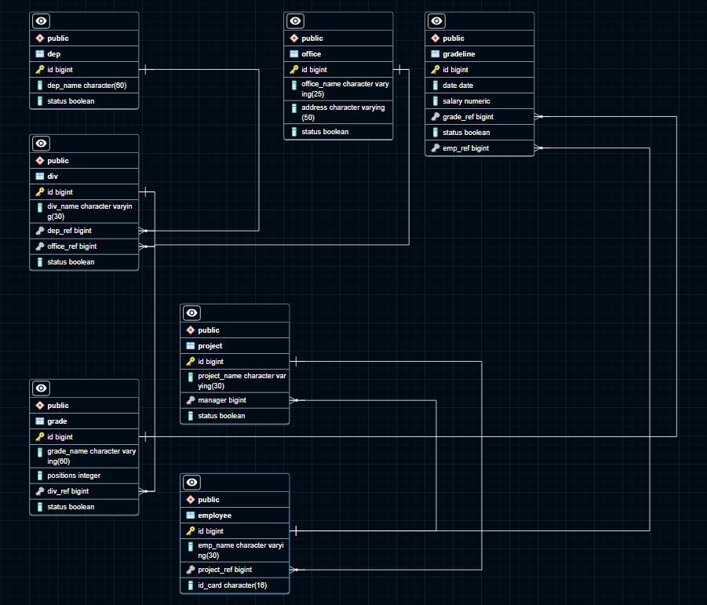

# Домашнее задание к занятию "`Задание 12.1 База данных`" - `Свинцов Николай`


### Инструкция по выполнению домашнего задания

   1. Сделайте `fork` данного репозитория к себе в Github и переименуйте его по названию или номеру занятия, например, https://github.com/имя-вашего-репозитория/git-hw или  https://github.com/имя-вашего-репозитория/7-1-ansible-hw).
   2. Выполните клонирование данного репозитория к себе на ПК с помощью команды `git clone`.
   3. Выполните домашнее задание и заполните у себя локально этот файл README.md:
      - впишите вверху название занятия и вашу фамилию и имя
      - в каждом задании добавьте решение в требуемом виде (текст/код/скриншоты/ссылка)
      - для корректного добавления скриншотов воспользуйтесь [инструкцией "Как вставить скриншот в шаблон с решением](https://github.com/netology-code/sys-pattern-homework/blob/main/screen-instruction.md)
      - при оформлении используйте возможности языка разметки md (коротко об этом можно посмотреть в [инструкции  по MarkDown](https://github.com/netology-code/sys-pattern-homework/blob/main/md-instruction.md))
   4. После завершения работы над домашним заданием сделайте коммит (`git commit -m "comment"`) и отправьте его на Github (`git push origin`);
   5. Для проверки домашнего задания преподавателем в личном кабинете прикрепите и отправьте ссылку на решение в виде md-файла в вашем Github.
   6. Любые вопросы по выполнению заданий спрашивайте в чате учебной группы и/или в разделе “Вопросы по заданию” в личном кабинете.
   
Желаем успехов в выполнении домашнего задания!
   
### Дополнительные материалы, которые могут быть полезны для выполнения задания

1. [Руководство по оформлению Markdown файлов](https://gist.github.com/Jekins/2bf2d0638163f1294637#Code)

---

### Задание 1

`Ответ в свободной форме на задание.`

1. `Анализируем какие данные представлены в файле, в целях переложить таблицу в файле на отдельные таблицы во 2-ой или 3 нормальной форме в целях максимально удобной эксплуатации этих данных в дальнейшем.`
2. `Исходя из имеющегося набора данных, будет создано 7 таблиц со следующей структурой`
3. `Таблица 1 служащих Employee: порядковый номер (далее ПН), ФИО, внешняя ссылка (далее ВС) должности, ВС проекта, ВС карьерного пути`
4. `Таблица 2 Департаментов Department: ПН, имя департамента, статус`
5. `Таблица 3 Отделов Division: ПН, наименование отдела, ВС на департамент, ВС на филиал, статус`
6. `Таблица 4 должностей Grade: ПН, наименование долности, ВС на отдел, количество позиций, статус`
7. `Таблица 5 филиалов Office: ПН, наименование филиала, адрес, статус`
8. `Таблица 6 проектов Project: ПН, проект, менеджер - ВС на сотрудника, статус`
9. `Таблица 7 карьерный путь Gradeline: ПН, ВС на служащего, дата приема на должность, зумма зп, ВС на должность, статус`
10. `Создаем таблицы с необходимыми условиями ограничений`

```sql
CREATE DATABASE DBNAME OWNER POSTGRES;

-- таблица департаментов со статусом активен/действет ли подраздение (колонка status)
CREATE TABLE IF NOT EXISTS public.dep (
    id bigint NOT NULL GENERATED BY DEFAULT AS IDENTITY ( INCREMENT 1 START 1 MINVALUE 0 MAXVALUE 9223372036854775807 CACHE 1),
    dep_name character(60) COLLATE pg_catalog."default" NOT NULL,
    status boolean NOT NULL DEFAULT false,
    CONSTRAINT dep_pkey PRIMARY KEY (id) );

-- таблица отделов со статусом активен/действует ли отдел (колонка status) 
CREATE TABLE IF NOT EXISTS public.div (
    id bigint NOT NULL GENERATED BY DEFAULT AS IDENTITY ( INCREMENT 1 START 1 MINVALUE 0 MAXVALUE 9223372036854775807 CACHE 1),
    div_name character varying(30) COLLATE pg_catalog."default" NOT NULL,
    dep_ref bigint NOT NULL DEFAULT 0,
    office_ref bigint NOT NULL DEFAULT 0,
    status boolean NOT NULL DEFAULT false,
    CONSTRAINT div_pkey PRIMARY KEY (id),
    CONSTRAINT dep_ref_fr_key FOREIGN KEY (dep_ref) REFERENCES public.dep (id) MATCH SIMPLE ON UPDATE NO ACTION ON DELETE RESTRICT,
    CONSTRAINT office_ref_fr_key FOREIGN KEY (office_ref) REFERENCES public.office (id) MATCH SIMPLE ON UPDATE NO ACTION ON DELETE SET NULL );

-- таблица сотрудников с дополнительным полем id_card (может потребоваться в виду появления сотрудников являющихся полной теской другим сотрудникам) 
CREATE TABLE IF NOT EXISTS public.employee (
    id bigint NOT NULL GENERATED BY DEFAULT AS IDENTITY ( INCREMENT 1 START 1 MINVALUE 0 MAXVALUE 9223372036854775807 CACHE 1),
    emp_name character varying(30) COLLATE pg_catalog."default" NOT NULL,
    project_ref bigint NOT NULL DEFAULT 0,
    id_card character(16) COLLATE pg_catalog."default" NOT NULL,
    CONSTRAINT employee_pkey PRIMARY KEY (id),
    CONSTRAINT project_ref_fr_key FOREIGN KEY (project_ref) REFERENCES public.project (id) MATCH SIMPLE ON UPDATE NO ACTION ON DELETE SET DEFAULT );

-- таблица должностей занимаемых сотрулником со статусом активна ли должность (колонка status) и полем positions (указанием сколько таких позиций есть в данном отделе, если требуется)
CREATE TABLE IF NOT EXISTS public.grade (
    id bigint NOT NULL GENERATED BY DEFAULT AS IDENTITY ( INCREMENT 1 START 1 MINVALUE 0 MAXVALUE 9223372036854775807 CACHE 1),
    grade_name character varying(60) COLLATE pg_catalog."default" NOT NULL,
    positions integer NOT NULL DEFAULT 1,
    div_ref bigint NOT NULL,
    status boolean NOT NULL DEFAULT false,
    CONSTRAINT grade_pkey PRIMARY KEY (id),
    CONSTRAINT div_ref_fr_key FOREIGN KEY (div_ref) REFERENCES public.div (id) MATCH SIMPLE ON UPDATE NO ACTION ON DELETE RESTRICT );

-- таблица позиций работника в компании с датой вступления в должность, окладом и статусом (колонка status)
-- активная/архивная (в случае увольнения или перевода) должность
CREATE TABLE IF NOT EXISTS public.gradeline (
    id bigint NOT NULL GENERATED BY DEFAULT AS IDENTITY ( INCREMENT 1 START 0 MINVALUE 0 MAXVALUE 9223372036854775807 CACHE 1),
    date date NOT NULL,
    salary numeric NOT NULL DEFAULT 0,
    grade_ref bigint NOT NULL DEFAULT 0,
    status boolean NOT NULL DEFAULT false,
    emp_ref bigint NOT NULL,
    CONSTRAINT gradeline_pkey PRIMARY KEY (id),
    CONSTRAINT emp_ref_fr_key FOREIGN KEY (emp_ref) REFERENCES public.employee (id) MATCH SIMPLE ON UPDATE NO ACTION ON DELETE RESTRICT,
    CONSTRAINT grade_ref_fr_key FOREIGN KEY (grade_ref) REFERENCES public.grade (id) MATCH SIMPLE ON UPDATE NO ACTION ON DELETE RESTRICT );

-- таблица филиалов со статусом филиал работает или уже закрыт (колонка status)
CREATE TABLE IF NOT EXISTS public.office (
    id bigint NOT NULL GENERATED BY DEFAULT AS IDENTITY ( INCREMENT 1 START 4 MINVALUE 0 MAXVALUE 9223372036854775807 CACHE 1),
    office_name character varying(25) COLLATE pg_catalog."default" NOT NULL,
    address character varying(50) COLLATE pg_catalog."default" NOT NULL,
    status boolean NOT NULL DEFAULT false,
    CONSTRAINT office_pkey PRIMARY KEY (id) );

-- таблица проектов
CREATE TABLE IF NOT EXISTS public.project (
    id bigint NOT NULL GENERATED BY DEFAULT AS IDENTITY ( INCREMENT 1 START 1 MINVALUE 0 MAXVALUE 9223372036854775807 CACHE 1),
    project_name character varying(30) COLLATE pg_catalog."default" NOT NULL,
    manager bigint NOT NULL DEFAULT 0,
    status boolean NOT NULL DEFAULT false,
    CONSTRAINT project_pkey PRIMARY KEY (id),
    CONSTRAINT employee_fr_key FOREIGN KEY (manager) REFERENCES public.employee (id) MATCH SIMPLE ON UPDATE NO ACTION ON DELETE SET DEFAULT );

Владельцем базы и ее объектов следует сделать отдельного пользователя, но эта часть уже относится к своЙству удобства обслуживания и эксплуатации, 
но и так же является общей рекомендацией.
Данная структура считаю достаточна для импорта данных, но может быть еще с оптимизирована в целях повышения эффективности использования в случае 
прироста данных и необходимости в повышении производительности и удобства эксплуатации.
Записи с порядковым номером 0 в таблицах dep, div, grade, project нужно сделать с полем 'none' как пустые записи, исхожу из того что это может 
потребоваться для нормальной работы логики приложения.
```

`Изображение схемы базы данных
`


---

### Задание 2

`Приведите ответ в свободной форме........`

1. `Заполните здесь этапы выполнения, если требуется ....`
2. `Заполните здесь этапы выполнения, если требуется ....`
3. `Заполните здесь этапы выполнения, если требуется ....`
4. `Заполните здесь этапы выполнения, если требуется ....`
5. `Заполните здесь этапы выполнения, если требуется ....`
6. 

```
Поле для вставки кода...
....
....
....
....
```

`При необходимости прикрепитe сюда скриншоты
`


---

### Задание 3

`Приведите ответ в свободной форме........`

1. `Заполните здесь этапы выполнения, если требуется ....`
2. `Заполните здесь этапы выполнения, если требуется ....`
3. `Заполните здесь этапы выполнения, если требуется ....`
4. `Заполните здесь этапы выполнения, если требуется ....`
5. `Заполните здесь этапы выполнения, если требуется ....`
6. 

```
Поле для вставки кода...
....
....
....
....
```

`При необходимости прикрепитe сюда скриншоты
`

### Задание 4

`Приведите ответ в свободной форме........`

1. `Заполните здесь этапы выполнения, если требуется ....`
2. `Заполните здесь этапы выполнения, если требуется ....`
3. `Заполните здесь этапы выполнения, если требуется ....`
4. `Заполните здесь этапы выполнения, если требуется ....`
5. `Заполните здесь этапы выполнения, если требуется ....`
6. 

```
Поле для вставки кода...
....
....
....
....
```

`При необходимости прикрепитe сюда скриншоты
`

---
## Дополнительные задания (со звездочкой*)

Эти задания дополнительные (не обязательные к выполнению) и никак не повлияют на получение вами зачета по этому домашнему заданию. Вы можете их выполнить, если хотите глубже и/или шире разобраться в материале.

### Задание 5

`Приведите ответ в свободной форме........`

1. `Заполните здесь этапы выполнения, если требуется ....`
2. `Заполните здесь этапы выполнения, если требуется ....`
3. `Заполните здесь этапы выполнения, если требуется ....`
4. `Заполните здесь этапы выполнения, если требуется ....`
5. `Заполните здесь этапы выполнения, если требуется ....`
6. 

`При необходимости прикрепитe сюда скриншоты
`
